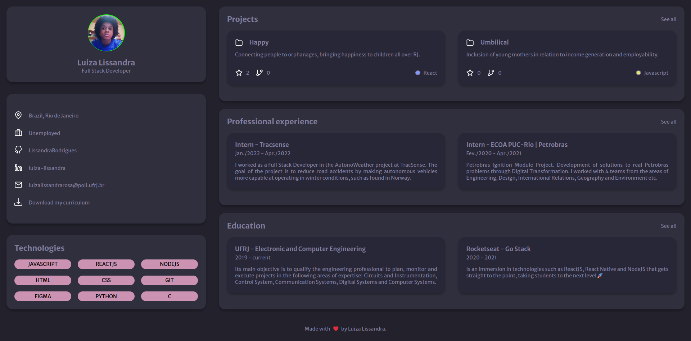

## Portfolio

In this project I was challenged to make a Portfolio using HTML and CSS. 

See the <a href="https://lissandrarodrigues.github.io/portfolio/"> deployment</a>.



<a href="https://app.rocketseat.com.br/discover/challenges/portfolio"> More about this challenge. </a>

### Technologies used

- HTML
- CSS

  ## :checkered_flag: Install this project ##

```bash
# Clone this project:
$ git clone https://github.com/LissandraRodrigues/portfolio

# Acess:
$ cd portfolio 
```
